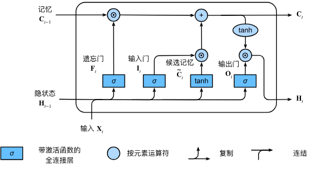
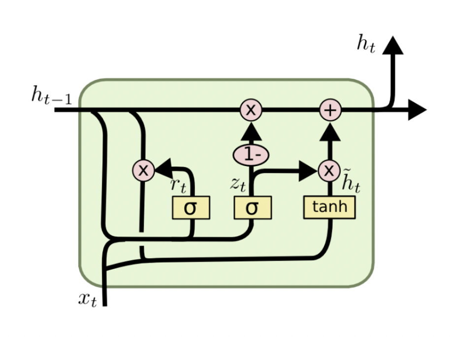

# LSTM&&GRU学习
##  资料
[理解LSTM网络]（https://colah.github.io/posts/2015-08-Understanding-LSTMs/）

## LSTM网络

- 关键状态：$c_t$（细胞状态，长期记忆）、$h_t$（隐藏状态，短期输出）
- 三个门的作用：
  - 遗忘门 $f_t$：决定保留多少上一步的记忆 $c_{t-1}$，防止无用信息累积
  - 输入门 $i_t$ + 候选内容 $\hat{g}_t$：选择写入多少新的信息到细胞状态
  - 输出门 $o_t$：决定从当前细胞状态 $c_t$ 暴露多少作为输出 $h_t$

- 典型计算 ：
  - 遗忘门：$f_t = \sigma(W_f \cdot [h_{t-1}, x_t] + b_f)$
  - 输入门：$i_t = \sigma(W_i \cdot [h_{t-1}, x_t] + b_i)$，候选内容：$\hat{g}_t = \tanh(W_g \cdot [h_{t-1}, x_t] + b_g)$
  - 细胞状态更新：$c_t = f_t \odot c_{t-1} + i_t \odot \hat{g}_t$
  - 输出门：$o_t = \sigma(W_o \cdot [h_{t-1}, x_t] + b_o)$
  - 隐藏状态输出：$h_t = o_t \odot \tanh(c_t)$
- 直观理解：
  - 遗忘门像“筛子”，保留有用的过去；
  - 输入门像“写开关”，把新信息写入记忆；
  - 输出门像“读开关”，把合适的记忆作为当前输出。

### LSTM 解决 RNN 的问题
- 梯度消失与爆炸：通过细胞状态的加性更新 $c_t = f_t \odot c_{t-1} + i_t \odot \hat{g}_t$ 形成近似恒等的“长梯度通道”，显著缓解长序列训练中的梯度消失/爆炸。
- 长期依赖难以捕获：遗忘门与输入门的联合控制让模型能选择性地“记住/忘记”信息，跨越长时间步保留关键上下文。
- 记忆与输出耦合：将“长期记忆”$c_t$ 与“当前输出”$h_t$ 分离，通过输出门控制暴露程度，避免简单 RNN 中状态既当记忆又当输出的冲突。
- 训练稳定性：门控与饱和激活（$\sigma$, $\tanh$）限制状态范围，减少数值不稳定与发散。
- 可解释性与可控性：门值提供显式的记忆管理信号，便于分析何时保留/写入/读取信息。

## GRU网络

- 关键状态：$h_t$（隐藏状态，携带当前时刻的上下文信息）
- 两个门的作用：
  - 更新门 $z_t$：控制“旧记忆”与“新内容”的融合比例
  - 重置门 $r_t$：控制在生成新内容时是否“遗忘”过去
- 典型计算流程：
  - 门值计算：  
    $$z_t = \sigma\big(W_z \cdot [h_{t-1}, x_t] + b_z\big)$$  
    $$r_t = \sigma\big(W_r \cdot [h_{t-1}, x_t] + b_r\big)$$
  - 候选隐藏状态：  
    $$\tilde{h}_t = \tanh\big(W_h \cdot [\,r_t \odot h_{t-1},\, x_t] + b_h\big)$$
  - 最终隐藏状态更新（加性混合，更稳定）：  
    $$h_t = (1 - z_t) \odot h_{t-1} + z_t \odot \tilde{h}_t$$
- 直观含义：
  - $r_t$ 像“选择性遗忘”，需要新的解读时弱化过去影响
  - $z_t$ 像“融合旋钮”，决定保留多少旧记忆、写入多少新内容
  - 加性更新避免纯替换，提升训练稳定性并缓解梯度消失

## 语言模型

基于 GRU 的语言模型实现流程（参考 rnn.ipynb）：

1. **数据预处理**
   - **构建词表 (Vocabulary)**：清洗文本，统计词频，建立 `Word <-> Index` 的双向映射。
   - **序列化**：将文本转换为整数索引序列。
   - **滑动窗口数据集**：构建 `(Input, Target)` 对。例如窗口大小为 N，输入为 `[w_1, ..., w_N]`，目标为 `w_{N+1}`（或者序列对序列预测）。

2. **模型架构**
   - **Embedding 层**：[Batch, Seq\_Len] → [Batch, Seq\_Len, Embed\_Dim]
     - 作用：将离散的整数索引（Index）映射为连续的稠密向量（Vector）。
     - 意义：让语义相近的词在向量空间中距离更近（如 "cat" 和 "dog"），为模型提供丰富的语义特征输入。
   - **GRU 层**（核心）：[Batch, Seq\_Len, Embed\_Dim] → [Batch, Seq\_Len, Hidden\_Dim]
     - 结构：由 Update Gate（更新门）和 Reset Gate（重置门）组成。
     - 机制：
       - **重置门 $$r_t$$**：决定是否忽略之前的隐藏状态（捕捉短期依赖）。
       - **更新门 $$z_t$$**：决定保留多少旧状态以及写入多少新内容（捕捉长期依赖）。
     - 输出：每个时间步 $$t$$ 都会输出一个隐藏状态 $$h_t$$，包含了从序列开始到当前时刻的上下文信息。
   - **Dropout 层**：防止过拟合，随机“丢弃”部分神经元，增强模型的泛化能力。
   - **全连接层 (Linear)**：[Batch, Seq\_Len, Hidden\_Dim] → [Batch, Seq\_Len, Vocab\_Size]
     - 作用：将高维的隐藏状态 $$h_t$$ 投影回词表大小的维度。
     - 输出：得到 Logits（未归一化的预测分数），每个维度对应词表中一个词的得分。

3. **训练过程**
   - **前向传播**：输入序列经过模型得到预测 Logits。
   - **计算损失**：使用 `CrossEntropyLoss` 比较预测 Logits 和真实的下一个词索引。
   - **反向传播**：计算梯度并更新模型参数。

4. **文本生成 (Inference)**
   - **初始化**：输入种子文本 (Seed Text)。
   - **预测**：模型输出最后一个时间步的 Logits。
   - **采样控制**：
     - **Temperature**：调节概率分布的平滑程度（低温保守，高温随机）。
     - **Top-K**：过滤掉低概率词，保留高概率候选。
     - **Multinomial Sampling**：根据概率分布随机抽取下一个词，增加多样性。
   - **循环**：将生成的词追加到输入序列，重复上述步骤生成后续文本。
