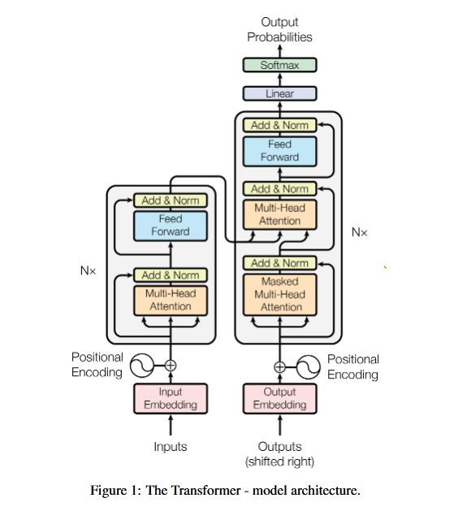

# Transformer 模型详解

## 1. 简介
Transformer 模型是由 Google 团队在 2017 年的经典论文《Attention Is All You Need》中提出的。它彻底改变了自然语言处理（NLP）领域的格局，摒弃了传统的循环神经网络（RNN）和卷积神经网络（CNN）结构，完全基于**注意力机制（Attention Mechanism）**来实现序列到序列（Seq2Seq）的建模。

Transformer 的主要优势在于：
*   **并行计算**：不像 RNN 需要按时间步顺序处理，Transformer 可以并行处理整个序列，大大提高了训练速度。
*   **长距离依赖**：通过自注意力机制，模型可以直接捕捉序列中任意两个位置之间的关系，无论它们相距多远，有效解决了长距离依赖问题。

---

## 2. 整体架构 (Architecture)
Transformer 采用标准的 **Encoder-Decoder（编码器-解码器）** 结构。

### Encoder (编码器)
*   由 $N=6$ 个相同的层**串行堆叠**而成（上一层的输出作为下一层的输入）。
*   每一层包含两个子层：
    1.  **多头自注意力机制 (Multi-Head Self-Attention)**
    2.  **位置逐点前馈网络 (Position-wise Feed-Forward Networks)**
*   每个子层后面都有**残差连接 (Residual Connection)** 和 **层归一化 (Layer Normalization)**。

### Decoder (解码器)
*   同样由 $N=6$ 个相同的层**串行堆叠**而成。
*   每一层包含三个子层：
    1.  **掩码多头自注意力机制 (Masked Multi-Head Self-Attention)**：确保预测只能依赖已知的前序位置（防止看见未来）。
    2.  **编码器-解码器注意力机制 (Encoder-Decoder Attention)**：Query 来自 Decoder，Key 和 Value 来自 Encoder 输出。
    3.  **位置逐点前馈网络 (Position-wise Feed-Forward Networks)**
*   同样包含残差连接和层归一化。

---

## 3. 核心组件详解

### 3.1 输入嵌入与位置编码 (Embeddings & Positional Encoding)
由于 Transformer 不使用循环结构，它本身无法感知单词的顺序信息。为了解决这个问题，需要加入**位置编码**。
*   **Input Embeddings**：将输入 Token 转换为向量。
*   **Positional Encoding**：将位置信息编码为向量，并与 Input Embeddings 相加。通常使用正弦和余弦函数生成。

### 3.2 注意力机制 (Attention Mechanism)
这是 Transformer 的核心。公式如下：
$$ \text{Attention}(Q, K, V) = \text{softmax}(\frac{QK^T}{\sqrt{d_k}})V $$
*   **Q (Query)**：查询向量
*   **K (Key)**：键向量
*   **V (Value)**：值向量
*   **Scaled Dot-Product Attention**：点积计算相似度，除以 $\sqrt{d_k}$ 进行缩放（防止梯度消失），Softmax 归一化得到权重，最后对 V 加权求和。

### 3.3 多头注意力 (Multi-Head Attention)
将 $d_{model}$ 维度的 Q, K, V 投影到 $h$ 个不同的子空间中并行计算 Attention，最后将结果拼接并线性映射回原维度。
*   **目的**：让模型能够从不同的“表示子空间”学习到不同位置的信息，增强模型的表达能力。

### 3.4 前馈神经网络 (Feed-Forward Networks)
每个 Attention 层之后都有一个全连接前馈网络，应用于每个位置：
$$ \text{FFN}(x) = \max(0, xW_1 + b_1)W_2 + b_2 $$
即包含两个线性变换，中间有一个 ReLU 激活函数。

### 3.5 残差连接与归一化 (Add & Norm)
每个子层的输出格式为：
$$ \text{LayerNorm}(x + \text{Sublayer}(x)) $$
这有助于训练深层网络，加速收敛。

---

## 4. 主要工作流程 (Transformer Process)

### 训练阶段 (Training)
1.  **输入处理**：源句子（Source）输入 Encoder，目标句子（Target）输入 Decoder（采用 Teacher Forcing，即输入正确答案并加上 Mask）。
2.  **Encoder 编码**：Transformer Encoder 处理源句子，输出包含语义信息的 Context Vectors（K 和 V）。
3.  **Decoder 解码**：
    *   Decoder 接收目标句子的 Input Embeddings + Positional Encodings。
    *   通过 Masked Self-Attention 处理自身序列信息。
    *   通过 Encoder-Decoder Attention 结合 Encoder 的输出（K, V）和 Decoder 的当前状态（Q）。
    *   最后通过 Feed-Forward 层。
4.  **输出预测**：Decoder 顶层输出经过 Linear + Softmax 层，预测下一个 Token 的概率分布。

### 推理/生成阶段 (Inference)
1.  Encoder 处理完整的源句子，生成 K, V 矩阵。
2.  Decoder 开始时输入 `<start>` 标记。
3.  Decoder 自回归地逐个生成单词：
    *   根据当前已生成的序列 + Encoder 的 K, V，预测下一个单词。
    *   将新生成的单词追加到 Decoder 输入序列中，重复此过程，直到生成 `<end>` 标记或达到最大长度。
---

### 前向传播数据维度变化
**Encoder**
*   **输入**：Padding 后 `[batch, seq_len]`
*   **Embedding**：`[batch, seq_len, d_model]`
*   **Position Encoder**：加上位置编码，`[batch, seq_len, d_model]`
*   **计算自注意力**：$Q, K, V$ 都为编码后的输入，`[batch, seq_len, d_model]` -> `[batch, seq_len, d_model]`
*   **标准化层**：`[batch, seq_len, d_model]` -> `[batch, seq_len, d_model]`
*   **残差连接**：`[batch, seq_len, d_model]` -> `[batch, seq_len, d_model]`
*   **前馈网络**：`[batch, seq_len, d_model]` -> `[batch, seq_len, d_model]`
*   **标准化层**：`[batch, seq_len, d_model]` -> `[batch, seq_len, d_model]`
*   **残差连接**：`[batch, seq_len, d_model]` -> `[batch, seq_len, d_model]`

**Decoder**
*   **输入**：Padding 后 `[batch, seq_len]`
*   **Embedding**：`[batch, seq_len, d_model]`
*   **Position Encoder**：加上位置编码，`[batch, seq_len, d_model]`
*   **计算自注意力、标准化、残差连接**：$Q, K, V$ 的输入为 Encoder Embedded + Position，`[batch, seq_len, d_model]` -> `[batch, seq_len, d_model]`
*   **计算编码器-解码器注意力、标准化、残差连接**：$Q$ 输入为 Decoder Embedded + Position，$K, V$ 输入为 Encoder 的输出，`[batch, seq_len, d_model]` -> `[batch, seq_len, d_model]`
*   **前馈网络、标准化、残差连接**：`[batch, seq_len, d_model]` -> `[batch, seq_len, d_model]`

**多头注意力计算**
*   **输入**：$X$, `[batch, seq_len, d_model]`
*   **线性投影 (Linear Projections)**：将 $X$ 分别投影到 $Q, K, V$，维度 `[batch, seq_len, d_model]`
*   **拆分多头 (Split Heads)**：将 $Q, K, V$ 拆分为 $h$ 个头，`[batch, seq_len, h, d_k]` -> 转置为 `[batch, h, seq_len, d_k]` (其中 $d_k = d_{model} / h$)
*   **计算注意力 (Attention)**：
    *   $scores = QK^T / \sqrt{d_k}$: `[batch, h, seq_len, d_k]` @ `[batch, h, d_k, seq_len]` -> `[batch, h, seq_len, seq_len]` (得到注意力分数)，除以 $\sqrt{d_k}$ 防止 Softmax 梯度消失
    *   **应用 Mask**: `[batch, h, seq_len, seq_len]` | mask -> `[batch, h, seq_len, seq_len]` (设置为 -1e9 的值，Softmax 后接近 0)
    *   **Softmax**: `[batch, h, seq_len, seq_len]`
    *   **计算加权和**: $scores @ V$: `[batch, h, seq_len, seq_len]` @ `[batch, h, seq_len, d_k]` -> `[batch, h, seq_len, d_k]`
*   **拼接多头 (Concat Heads)**：`[batch, h, seq_len, d_k]` -> 转置及拼接 -> `[batch, seq_len, d_model]`
*   **线性投影**：再经过一个线性层，提取整合不同头注意力信息，`[batch, seq_len, d_model]` -> `[batch, seq_len, d_model]`
*   **返回计算结果**

## 5. 总结
Transformer 凭借其并行计算能力和强大的全局上下文捕获能力，成为了现代 NLP 模型的基石（如 BERT, GPT 系列）。理解 Transformer 的架构是深入学习大模型的必经之路。
